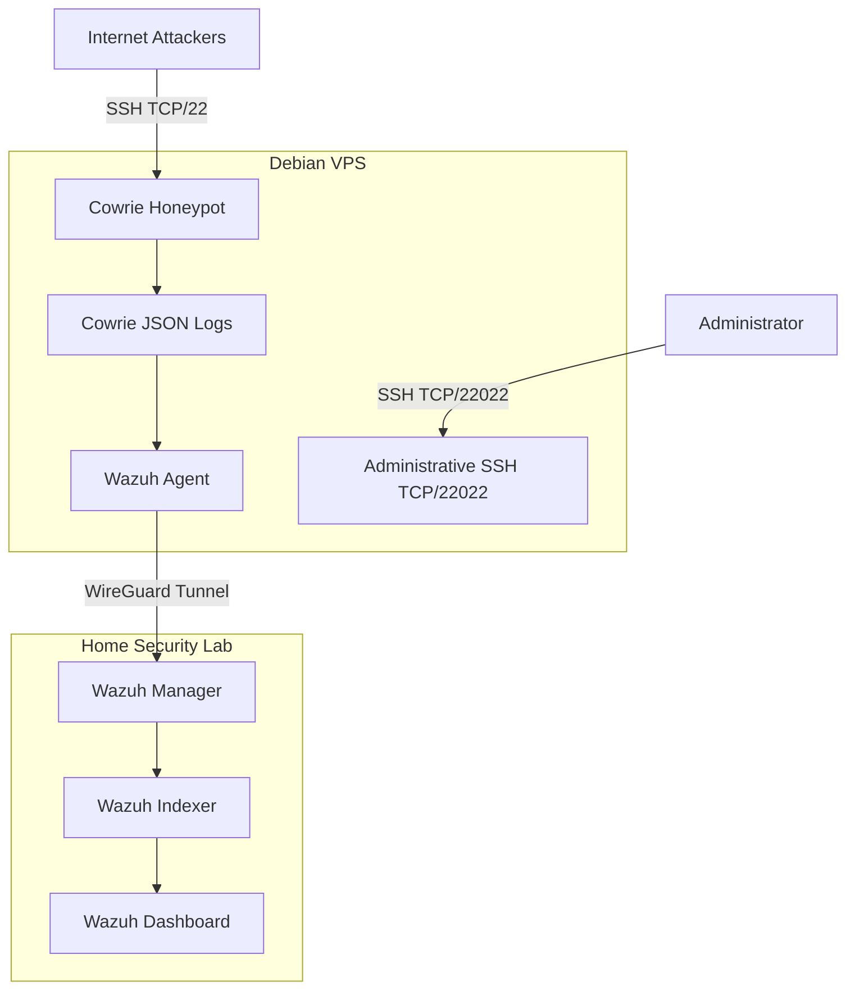

Internet-Exposed Cowrie Honeypot with Wazuh SIEM Monitoring
Overview

This project documents the design and deployment of an Internet-facing SSH honeypot using Cowrie on a Debian VPS, integrated with a self-hosted Wazuh SIEM environment.

The goal was not only to collect SSH attack activity, but to build a small defensive monitoring architecture around the honeypot. Cowrie captures attacker interactions on TCP/22, while the VPS itself is monitored for signs of compromise such as unexpected services, configuration changes, real SSH authentication, and loss of security telemetry.

Security events are forwarded from the VPS to Wazuh through a dedicated WireGuard tunnel.

Architecture

Key Design Decisions
Cowrie exposed publicly on TCP/22
Legitimate administrative SSH moved to TCP/22022
Wazuh telemetry transported over WireGuard
Firewall rules restrict VPS access to monitoring infrastructure
Cowrie activity is treated separately from real VPS activity
Host-level monitoring is used to detect possible honeypot escape or compromise
Technologies Used
Cowrie
Debian Linux
Wazuh
WireGuard
SSH
UFW / iptables
Docker
JSON log ingestion
File Integrity Monitoring
Custom Wazuh rules and monitoring logic
Honeypot Configuration

The Cowrie environment was customized to provide a more believable Linux target rather than using only the default filesystem.

Simulated artifacts include:

/home/admin
/srv/backups
/etc/cron.d/nightly-backup
/opt/backup/rotate.sh

The environment also contains simulated users and service-account artifacts intended to encourage attacker enumeration and post-authentication activity.

No real credentials or sensitive information are intentionally exposed through the honeypot.

Wazuh Integration

Cowrie generates structured JSON telemetry that is collected by the Wazuh agent.

The monitoring pipeline is:

Internet Attack
      ↓
Cowrie
      ↓
Cowrie JSON Logs
      ↓
Wazuh Agent
      ↓
WireGuard
      ↓
Wazuh Manager
      ↓
Detection / Alert
      ↓
Investigation

This allows honeypot events to be analyzed alongside host-level security activity.

Detection and Monitoring

The project is designed to monitor both attacker activity inside Cowrie and possible compromise of the VPS itself.

Honeypot Activity

Monitored Cowrie events include:

cowrie.session.file_download
cowrie.session.file_upload
cowrie.direct-tcpip.request
Authentication attempts
Successful honeypot logins
Commands executed by attackers
Session activity
Host Security Monitoring

Higher-priority monitoring includes:

Successful or failed real SSH authentication on TCP/22022
Cowrie configuration changes
SSH configuration changes
Wazuh agent disconnection
Cowrie service failure
Unexpected processes
Unexpected network listeners
Firewall or network configuration changes

This distinction is important because malicious activity inside the honeypot is expected, while unexpected activity affecting the actual VPS may indicate a real compromise.

Example Investigation
Malformed SSH Traffic

The honeypot captured unusual SSH traffic that generated a Cowrie alert containing a raw hexadecimal payload.

Analysis of the packet identified SSH protocol structures including:

ssh-connection
publickey
ssh-rsa

The investigation involved:

Extracting the hexadecimal payload
Converting the payload into readable binary and ASCII data
Identifying SSH protocol fields
Reviewing the packet structure
Determining whether the behavior appeared malformed, automated, or potentially exploit-related

A full sanitized analysis will be documented in:

investigations/attack-case-001.md
Challenges and Lessons Learned
Honeypot Filesystem Emulation

Troubleshooting Cowrie's simulated filesystem required understanding the difference between the actual VPS filesystem and the environment presented to attackers.

Secure Monitoring Architecture

Connecting an Internet-facing honeypot to a private monitoring environment introduced an important trust boundary. WireGuard and restrictive firewall rules were used to prevent the honeypot from gaining unnecessary access to the internal network.

Logging vs. Detection

Collecting logs alone does not create useful security monitoring. Events must be parsed, evaluated, correlated, and turned into actionable alerts.

Monitoring the Host

Because malicious activity inside Cowrie is expected, host-level monitoring is critical. Real SSH activity, unexpected processes, configuration changes, and security-agent failures are treated as significantly higher-risk events.

Repository Structure
cowrie-honeypot-security-lab/
│
├── README.md
│
├── architecture/
│   └── honeypot-architecture.png
│
├── configs/
│   ├── cowrie.cfg.example
│   ├── wazuh-agent-example.xml
│   └── firewall-example.sh
│
├── detections/
│   └── cowrie-wazuh-rules.xml
│
├── investigations/
│   └── attack-case-001.md
│
├── evidence/
│   └── sanitized-screenshots/
│
└── docs/
    ├── security-controls.md
    └── wazuh-integration.md
Future Improvements
Add additional custom Wazuh detections
Add sanitized alert screenshots
Document more attacker sessions
Add IOC and malware-hash analysis
Add IP geolocation enrichment
Map observed behavior to MITRE ATT&CK
Build scripts for Cowrie session analysis
Create Wazuh dashboards for honeypot activity
Security Notice

All configuration examples in this repository are sanitized.

Private keys, credentials, tokens, certificates, and unnecessary infrastructure details are excluded or replaced with placeholders.

This project is operated for defensive cybersecurity research, monitoring, and education.
