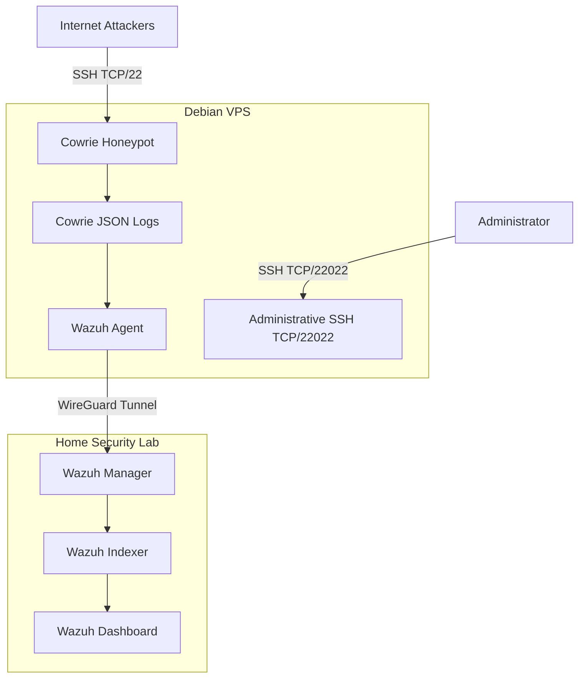

# Cowrie Honeypot Security Lab — Wazuh SIEM, Detection Engineering & Threat Investigation

An Internet-facing SSH honeypot and defensive monitoring environment built to capture real attacker telemetry, investigate post-authentication activity, develop detections, preserve evidence, and monitor the underlying host for signs of actual compromise.

---

## Overview

This project documents the design and deployment of an Internet-facing SSH honeypot using Cowrie on a Debian VPS, integrated with a self-hosted Wazuh SIEM environment.

The goal was not only to collect SSH attack activity, but to build a small defensive monitoring architecture around the honeypot.

Cowrie captures attacker interactions on TCP/22, while the underlying VPS is monitored for signs of actual compromise, including:

* Unexpected services or processes
* Configuration changes
* Real SSH authentication
* Wazuh agent disconnection
* Cowrie service failure
* Unexpected network listeners

  

Security telemetry is forwarded from the VPS to Wazuh through a dedicated WireGuard VPN tunnel.

---

## Project Highlights

- Built and hardened an Internet-exposed Cowrie SSH honeypot on a Debian VPS.
- Integrated Cowrie JSON telemetry with a self-hosted Wazuh SIEM over an isolated WireGuard tunnel.
- Developed monitoring for both expected honeypot activity and indicators of actual VPS compromise.
- Investigated real attacker sessions using Cowrie telemetry, protocol analysis, MITRE ATT&CK, and external threat intelligence.
- Preserved and documented attacker-uploaded artifacts, including a multi-architecture RedTail malware deployment.
- Current work is expanding the project into static malware analysis and deeper threat hunting.

---

## Featured Investigations
### [Case 001 – Malformed SSH Authentication Probe](./investigations/ssh-attack-case-001.md)
Investigated suspicious SSH authentication traffic captured by Cowrie, correlated the activity with CVE-2018-15473, documented evidence limitations, and mapped observed behavior to MITRE ATT&CK.

### [Case 002 – RedTail Malware Deployment via SSH/SFTP](./investigations/ssh-attack-case-002.md)
Captured and investigated a multi-architecture malware deployment involving SFTP-delivered payloads, cleanup scripts, SSH persistence, artifact deletion, SHA-256 preservation, and threat-intelligence correlation.

<br>

> **Current focus:** Static malware analysis of the captured RedTail x86-64 sample.

## Investigation Evidence

Each investigation is supported by sanitized evidence collected from the lab.

```text
investigations/
├── ssh-attack-case-001.md
└── ssh-attack-case-002.md

evidence/
├── ssh-attack-case-001/
└── ssh-attack-case-002/
    ├── cowrie/
    ├── hashes/
    ├── scripts/
    └── threat-intelligence/
```
Evidence may include:

- Sanitized Cowrie session telemetry
- Original attacker commands
- File-transfer records
- SHA-256 indicators
- Analyst-reviewed scripts
- Threat-intelligence correlations
- Derived analysis artifacts

> Executable malware samples are intentionally excluded from the public repository.

---

## Architecture


Simplified logical architecture showing the primary telemetry and management paths.

---

## Key Design Decisions

* **Target Exposure:** Cowrie is exposed publicly on standard SSH (`TCP/22`) to attract automated scanners and brute-force attempts.
* **Management Isolation:** Legitimate administrative SSH is moved to TCP/22022, protected with key-based authentication, and restricted by UFW to connections originating from my trusted home public IP. All other inbound connection attempts to the administrative SSH port are denied by the host firewall.
* **Encrypted Telemetry Transport:** Wazuh telemetry transported over **WireGuard** tunnel.
* **Least-Privilege Network Access:** Host firewall rules (UFW/iptables) restrict traffic to explicitly required communication paths. Public access is permitted to Cowrie on TCP/22, while administrative SSH on TCP/22022 is limited to a trusted source IP and WireGuard/Wazuh communication is separately constrained.
* **Dual-Tier Security Monitoring:** Expected Cowrie attacker telemetry is classified separately from host-level security events, with host-compromise indicators receiving higher investigative priority.

---

### Administrative Access Control

Cowrie remains exposed on TCP/22 to capture Internet-based SSH activity, while legitimate administrative SSH access is moved to TCP/22022. UFW restricts port 22022 to the administrator's trusted home IP, reducing exposure of the real SSH service. Honeypot traffic and administrative access are therefore logically separated, allowing Cowrie to remain publicly accessible without exposing the VPS management interface broadly to the Internet. Additional monitoring is configured to alert on authentication activity involving the real SSH service.

---

## Technologies Used

| Category | Technologies / Tools |
| :--- | :--- |
| **Honeypot & Emulation** | Cowrie |
| **Operating Systems** | Debian Linux, Ubuntu Server |
| **SIEM & Monitoring** | Wazuh Manager, Wazuh Agent, Custom XML Detection Rules |
| **Networking & Security** | WireGuard VPN, UFW, `iptables`, SSH, OpenSSH |
| **Infrastructure**        | Docker                                                     |
| **Data & Log Analysis** | Structured JSON Ingestion, File Integrity Monitoring (FIM) |

---

## Honeypot Configuration

The Cowrie environment was customized to present a more believable Linux server persona with administrative, service-account, scheduled-task, and backup artifacts rather than relying entirely on the default filesystem template.

### Simulated Artifacts
* `/home/admin`
* `/srv/backups`
* `/etc/cron.d/nightly-backup`
* `/opt/backup/rotate.sh`

The environment includes customized fake users, fake directory trees, and service account artifacts designed to encourage attacker post-authentication enumeration. 

> [!NOTE]
> No real credentials, production API keys, or sensitive internal data are intentionally exposed within the simulated honeypot environment.

---

## Wazuh Integration & Telemetry Pipeline

Cowrie generates structured JSON telemetry (`cowrie.json`) that is ingested locally by the Wazuh agent and passed back to the lab environment.

```text
[ Internet Attack ] 
        │ (TCP/22)
        ▼
[ Cowrie Honeypot ] ──► [ Local JSON Logs ]
                                │
                                ▼
                        [ Wazuh Agent ]
                                │
                                ▼ (WireGuard Tunnel)
                        [ Wazuh Manager ] ──► [ Wazuh Rules / Custom Detections ]
                                                        │
                                                        ▼
                                                [ Dashboard & Alert ]

```
---

## Detection and Monitoring

The environment maintains two distinct alert models: **Attacker Telemetry** (expected noise) and **Host Compromise Signals** (high-priority investigation).

### 1. Honeypot Activity
| Event | Investigative Priority |
| :--- | :--- |
| `cowrie.session.file_download` / `file_upload` | Medium |
| `cowrie.direct-tcpip.request` (Port forwarding / proxy attempts) | Medium |
| SSH credential guessing and brute-force attempts | Low |
| Successful decoy logins and executed shell commands | Medium |

### 2. Host Security Monitoring
| Event | Investigative Priority |
| :--- | :--- |
| Administrative SSH authentication failure from trusted management source | Medium / High |
| Repeated administrative SSH failures | High |
| Unexpected successful administrative login | High / Critical |
| Cowrie configuration modification | High |
| Unexpected Wazuh agent termination | High / Critical |
| Unexpected network listener | High |
<br>
This distinction is important because malicious activity inside the honeypot is expected, while unexpected activity affecting the actual VPS may indicate a real compromise.

---

## MITRE ATT&CK Mapping

Observed attacker behaviors captured during honeypot events and investigations include:

| Tactic | Technique | ID | Observed Evidence |
|---|---|---|---|
| Credential Access | Brute Force: Password Guessing | `T1110.001` | Repeated SSH credential attempts |
| Execution | Command and Scripting Interpreter: Unix Shell | `T1059.004` | Shell commands and attacker-uploaded scripts |
| Discovery | System Information Discovery | `T1082` | `uname -a`, `uname -mp` |
| Discovery | File and Directory Discovery | `T1083` | `ls`, `find`, and filesystem enumeration |
| Persistence | Account Manipulation: SSH Authorized Keys | `T1098.004` | Attacker-controlled key written to `~/.ssh/authorized_keys` |
| Command and Control | Ingress Tool Transfer | `T1105` | Malware and scripts transferred via SFTP |
| Defense Evasion | Indicator Removal: File Deletion | `T1070.004` | Deletion of deployment scripts and payload artifacts |
| Impact | Resource Hijacking: Compute Hijacking | `T1496.001` | RedTail cryptomining deployment |

---


## Key Takeaways & Lessons Learned

* **Trust Boundaries Matter:** Connecting an Internet-exposed honeypot to private monitoring infrastructure introduces a high-risk trust boundary. WireGuard and restrictive firewall policies limit the VPS's ability to communicate with private infrastructure if the host is compromised.
* **Noise vs. Actionable Telemetry:** Logging everything is trivial; surfacing relevant alerts requires tuning. Disambiguating expected decoy logs from legitimate host alerts prevents analyst alert fatigue.
* **Host Monitoring is Critical:** Host-level FIM, service monitoring, and process/listener visibility provide an additional layer of detection for activity affecting the underlying VPS.

---

<!-- ## Repository Structure

```text
cowrie-honeypot-security-lab/
│
├── README.md
│
├── architecture/
│   └── honeypot-architecture.png
│
├── configs/
│   ├── cowrie.cfg.example
│   ├── wazuh-agent-example.xml
│   └── firewall-example.sh
│
├── detections/
│   └── cowrie-wazuh-rules.xml
│
├── investigations/
│   └── attack-case-001.md
│
├── evidence/
│   └── sanitized-screenshots/
│
└── docs/
    ├── security-controls.md
    └── wazuh-integration.md
```
-->
---

## Future Roadmap

- [ ] Complete static analysis of the captured RedTail x86-64 ELF sample.
- [ ] Extract and document network and configuration indicators from captured malware.
- [ ] Develop Wazuh detections based on findings from malware analysis.
- [ ] Automate enrichment of captured file hashes using threat-intelligence sources.
- [ ] Expand Wazuh dashboards for honeypot and threat-intelligence telemetry.

---

## Security & Sanitization Notice
Sensitive operational information has been removed or replaced with non-functional placeholders. Private lab addressing may be retained where useful to demonstrate network architecture and does not identify publicly reachable infrastructure. This environment exists purely for defensive research, educational purposes, and security analysis.
